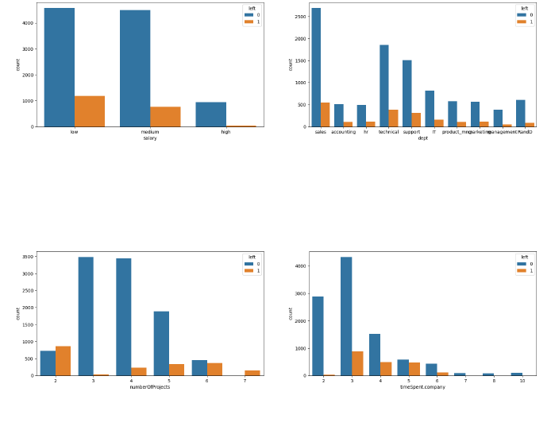

# EDA-Projects
Exploratory Data Analysis Project 
Description
This repository contains two exploratory data analysis (EDA) projects: HR Analysis - Attrition Rate and Airline Statistics. Each project focuses on analyzing relevant datasets to gain insights and present findings using Python and data visualization libraries.

# Projects
1. HR Analysis 
This project aims to analyze the attrition rate within a company's human resources department. By examining various factors such as employee demographics, job satisfaction, and work-life balance, we seek to identify patterns and potential causes of attrition. The analysis is performed using Python and popular data analysis libraries such as Pandas and Matplotlib.

2. Airline Statistics

The Airline Statistics project focuses on exploring and visualizing datasets related to the airline industry. It involves analyzing factors such as flight delays, cancellations, and customer satisfaction to understand the performance and trends within the airline sector. Python, along with libraries like Pandas and Seaborn, is utilized for data manipulation and visualization purposes.

# Sample Images
HR Analysis  

 
Description of the image: This image shows a bar chart representing the attrition rate by department within the company.
Each bar represents a different department, and the height of the bars indicates the percentage of employees who have left the department.

Airline Statistics 
 

Description of the image: This image displays a line plot representing the average flight delay time over a specific time period. 
The x-axis represents the dates, and the y-axis represents the average delay time in minutes. The line shows the trend in flight delays, highlighting any noticeable patterns or fluctuations.
